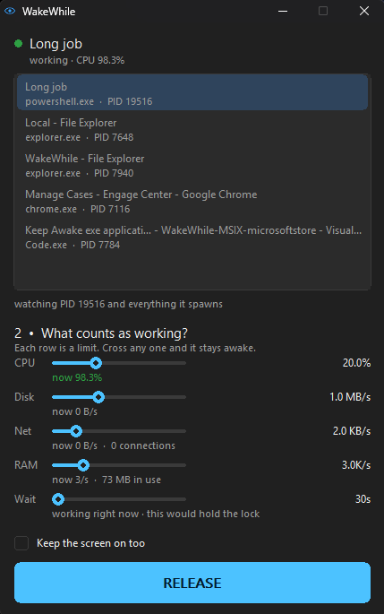
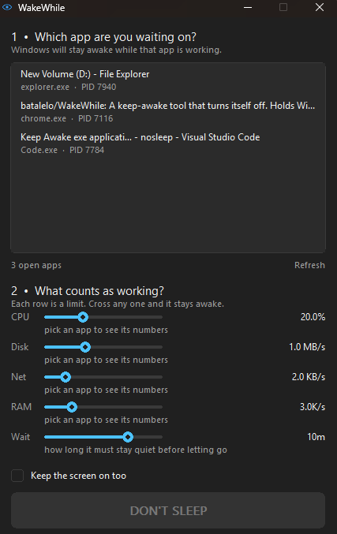

<div align="center">

# WakeWhile

**Keep Windows awake — but only while the app you pick is actually working.**

Stay awake while it's working. Sleep when it's not.

A free, open-source Windows utility that prevents your PC from sleeping during
a render, a build, a large upload or an AI agent run — and then releases the
lock by itself once the work finishes. No toggle to forget about.

**90 KB · one file · no installer · no dependencies · no admin rights**

[**Download**](../../releases/latest) · [Install](#install) · [What people use it for](#what-people-use-it-for) · [How it decides](#how-it-decides-whether-an-app-is-working) · [FAQ](#faq) · [Build from source](#building-from-source)

[](https://github.com/batalelo/WakeWhile/actions/workflows/build.yml)
[](LICENSE)




*A real job, sped up five times. It takes the lock while the work runs,
counts the silence when it stops, and lets go on its own.*

</div>

---

## The problem

Windows sleeps on an idle timer, and that timer does not care that you are
three hours into a render, halfway through a 40 GB upload, or watching a
coding agent work through a task.

The usual fix is to disable sleep entirely. Which means remembering to turn it
back on — and paying for it in battery every time you forget.

## What WakeWhile does

1. Open it. You get a list of the apps you currently have open, the same set
   Alt+Tab shows.
2. Pick the one you are waiting on.
3. Press **DON'T SLEEP**.

It drops to the system tray and watches. Windows stays awake for as long as
that app is genuinely working, and the moment it goes quiet for long enough,
the lock releases itself and normal sleep behaviour resumes.

The tray icon is an eye: **open** while the lock is held, **closed** once it is
let go.

<div align="center">

</div>

## Requirements

Windows 10 or Windows 11, 64-bit. Nothing else — no .NET, no Visual C++
runtime, no service, no administrator rights.

## Install

### Download it

There is no installer. Just download `WakeWhile.exe` from
[Releases](../../releases/latest) and run it. Put it anywhere you like.

Every release is built by GitHub Actions from the tagged commit and publishes
its SHA-256, so the binary you download can be checked against the source that
produced it:

```
certutil -hashfile WakeWhile.exe SHA256
```

### Or with winget

```
winget install WakeWhile
```

> Not live yet — the manifest is in review at
> [microsoft/winget-pkgs#423169](https://github.com/microsoft/winget-pkgs/pull/423169).
> Use the download above until it merges.

### Or from the Microsoft Store

Not listed yet. The packaging that gets it there lives in
[batalelo/WakeWhile-MSIX](https://github.com/batalelo/WakeWhile-MSIX) — the
same program built as MSIX, which the Store signs rather than shipping
unsigned.

### Uninstalling

Delete the file. It writes two small files beside itself — `WakeWhile.log` and
`WakeWhile.ini` — and touches nothing else. No registry keys, no `%APPDATA%`,
no startup entries. If you installed it with winget, `winget uninstall
WakeWhile` does the same.

---

## How it decides whether an app is "working"

Four signals, sampled once a second, summed over **the chosen app and every
process it has spawned**. That last part matters: in Chrome, VS Code, Cursor,
Discord and every other Electron app, the window you clicked belongs to a
parent process that idles near zero while a child does the real work.

| Signal | What it measures | What it catches |
|---|---|---|
| **CPU** | kernel + user time, as a percentage of **one core** | renders, builds, compression, encoding |
| **Disk** | `ReadFile` + `WriteFile` bytes per second | exports, copies, downloads landing on disk |
| **Network** | socket traffic, gated on a live connection to another machine | AI API sessions, uploads, streaming |
| **Memory** | page faults per second | anything churning through memory |

CPU is measured as a share of **one core**, not of the whole machine, so the
number means the same thing on a 4-thread laptop and a 32-thread workstation.
Task Manager divides by the logical processor count, which is why one fully
busy core reads 6% there on a 16-thread box and 25% on a 4-thread one.

Any one signal crossing its limit counts as working. Each limit is a slider,
with the app's live reading printed directly underneath it — and the readings
start the moment you select an app, before you commit to anything.

<div align="center">

</div>

## What people use it for

WakeWhile does not know or care what an app is. It watches four numbers, so it
works with anything that keeps a window open while it works. These are the
cases people run into most, and roughly which signal carries each one.

### AI agents and assistants

The case this was built for. An agent run is mostly *waiting on the network* —
almost no CPU, long quiet gaps between bursts — which is exactly when a machine
decides to sleep. Pick the editor or terminal the agent runs in and it is
covered, because the whole process tree is watched.

**Claude Code · Antigravity · Cursor · GitHub Copilot · Windsurf · Cline ·
Aider · Continue · Roo Code · Zed · Ollama · LM Studio · ComfyUI ·
Automatic1111 / Stable Diffusion WebUI**

Mostly **network** and **CPU**. If your agent pauses for longer than the wait,
drag the **Wait** slider right.

### Rendering, editing and encoding

A render pegs cores for hours and the machine has no business sleeping through
it — but it also has no business staying up all night once the render is done.

**Blender · DaVinci Resolve · Adobe Premiere Pro · After Effects · Media
Encoder · HandBrake · Cinema 4D · Autodesk Maya · 3ds Max · Unreal Engine ·
Unity · OBS Studio · Topaz Video AI · VirtualDub · FFmpeg**

Mostly **CPU** and **disk**. The defaults already catch these comfortably.

### Builds, compiles and long test runs

**Visual Studio · Visual Studio Code · IntelliJ IDEA · Android Studio ·
Rider · CLion · PyCharm · Docker Desktop · WSL · Gradle · Maven · npm ·
Cargo · CMake · MSBuild**

Mostly **CPU** and **disk**. WakeWhile follows child processes, so a compiler
spawned by your editor counts even while the editor window sits idle.

### Downloads, uploads, backups and transfers

Bytes moving is work, even when the CPU is asleep. This is why there is a
network channel at all.

**qBittorrent · JDownloader · Internet Download Manager · Steam · Epic Games
Launcher · Battle.net · rclone · FileZilla · WinSCP · Google Drive · Dropbox ·
OneDrive · Backblaze · Veeam · Macrium Reflect · Acronis · Robocopy · 7-Zip ·
WinRAR**

Mostly **network** and **disk**.

### Long-running computation

**MATLAB · R and RStudio · Jupyter · Anaconda · SPSS · ANSYS · SolidWorks ·
AutoCAD · QGIS · BOINC · Folding@home**

Mostly **CPU** and **memory**.

### Media servers and scanning

**Plex · Emby · Jellyfin · Malwarebytes · Windows Defender full scans ·
Everything indexing**

Mostly **disk**.

If the app you are waiting on is not on this list, it still works — the list is
not a whitelist, it is just what people ask about.

---

## The defaults, and the trade they take

| | Default | Range |
|---|---|---|
| CPU | 20% of one core | 5% – 400% |
| Disk | 1 MB/s | 64 KB/s – 256 MB/s |
| Network | 2 KB/s | 512 B/s – 4 MB/s |
| Memory | 3,000 faults/s | 500 – 2,000,000 |
| Wait | 10 minutes | 30 s – 30 min |

They are set to catch real work rather than to let a noisy editor sleep, which
is a deliberate choice between two things you cannot have at once. An IDE that
pipes a couple of megabytes a second to itself while nobody is touching it
will hold the lock at these settings. Drag **Disk** and **CPU** right if you
would rather that machine slept.

Move any slider and it is remembered in `WakeWhile.ini` beside the executable.
Delete that file to go back to the defaults.

---

## Why your idle editor uses more CPU than your working one

This is the finding that shaped the whole design, and it is not what you would
guess.

Measured on a real machine: 300 seconds of an active AI coding session inside
VS Code, against 180 seconds of the same editor genuinely left alone.

| | **Idle** (median) | **Working** (median) |
|---|---|---|
| CPU | **295**‰ of a core | 205‰ |
| Disk | **2.28 MB/s** | 652 KB/s |
| Network | **677 B/s** | 467 B/s |
| Memory | **1,234 faults/s** | 699 faults/s |

**The idle editor reads higher than the working one on every single signal.**

It makes sense once you see it. While the model is generating, the editor
itself is doing almost nothing — it is waiting on a socket. While nobody is
there at all, its file watcher, its language servers and its extension host
hum along steadily forever.

So the two distributions are not merely overlapping, they are **inverted**, and
no usage threshold can separate them. Lower the limits enough to catch the
work and an idle machine reads 99% busy and never sleeps.

What *does* separate them is how long the quiet stretches run:

| | Longest quiet stretch |
|---|---|
| Working | **74 s** |
| Idle | **161 s** |

Which is why WakeWhile does not release on a single quiet reading. It keys on
the **length of continuous silence**, and that period is the fifth slider.

---

## The log

`WakeWhile.log` is written next to the executable, one line per second while
watching. It exists so that "why won't my computer go to sleep" always has an
answer you can read:

```
2026-08-24 07:03:32  WakeWhile started
2026-08-24 07:03:32    thresholds: cpu 200 permille | disk 1048576 B/s | net 2048 B/s | mem 3000 faults/s | wait 600s
2026-08-24 07:03:40  watching: my-project - Visual Studio Code
2026-08-24 07:03:41  tick procs=26 cpu=189/200 disk=1877432/1048576 net=122/2048 mem=656/3000 ws=3253MB conn=3 -> BUSY (disk) quiet=0s lock=held
2026-08-24 07:14:02  tick procs=26 cpu=41/200 disk=90112/1048576 net=0/2048 mem=88/3000 ws=3251MB conn=0 -> IDLE (-) quiet=601s lock=off
```

Each pair is `measured/limit`. The word in brackets is which signal decided it
— `cpu`, `disk`, `net`, `mem`, or `-` for none. A trailing `r` on a limit means
the app's own baseline raised it. `lock=held` / `lock=off` is the Windows sleep
lock itself.

If the machine is staying awake and you want to know why, find the last line
with something other than `-` in brackets.

---

## FAQ

### How do I keep Windows awake without disabling sleep?

That is what WakeWhile is for. Instead of turning sleep off globally, it holds
a temporary lock only while a specific app is busy, and drops it afterwards.
Your power plan stays exactly as you configured it.

### How do I stop my PC from sleeping during a render or export?

Open WakeWhile, pick your renderer from the list — Blender, Premiere, DaVinci
Resolve, Handbrake, whatever it is — and press DON'T SLEEP. A render pegs the
CPU well past the default limit, so the lock holds until the render finishes,
then releases on its own.

### How do I keep my laptop awake while downloading a large file?

Pick the browser or download client. Sustained transfers cross the disk or
network limit, so the machine stays up while bytes are moving and sleeps once
they stop.

### How do I keep my PC awake during a long build?

Pick your IDE or terminal. WakeWhile watches the whole process tree, so a
compiler spawned by your editor counts even though the editor window itself is
idle.

### How do I keep Windows awake while an AI agent runs?

Pick the editor or terminal your agent runs in. This case is the reason the
`Wait` slider exists: an agent session is mostly *waiting on the network*, with
long quiet gaps between bursts. See
[the measurement above](#why-your-idle-editor-uses-more-cpu-than-your-working-one).

### Why won't my computer go to sleep?

Something is holding a system power request. Run this in an elevated prompt to
see what:

```
powercfg /requests
```

If WakeWhile is the one holding it, you will see `WakeWhile.exe` listed under
`SYSTEM`, and `WakeWhile.log` will tell you which signal is responsible and
what the reading was.

### Is this a mouse jiggler?

No. Mouse jigglers fake input, which keeps the screen on, defeats your lock
screen and lies to anything watching for user presence. WakeWhile asks Windows
directly, through the documented power API, and never touches your input.

### Does it keep the screen on too?

Only if you tick **Keep the screen on too**. By default the display is allowed
to turn off normally while the machine itself stays awake — which is usually
what you want for an overnight render.

### Can it watch more than one app at a time?

Not currently. It watches one app and its process tree. If you need two, run a
second copy from a different folder — the single-instance lock is per install.

### What exactly does it call?

`SetThreadExecutionState(ES_CONTINUOUS | ES_SYSTEM_REQUIRED)`, plus
`ES_DISPLAY_REQUIRED` when the screen box is ticked. That is the documented
Windows API for exactly this, the same one media players use. Clearing it is a
single call, it is scoped to the process, and Windows drops the request
automatically if the process dies — so a crash cannot leave your machine
permanently awake.

### Is it safe? It's an unsigned executable.

It is unsigned, which means SmartScreen will warn you the first time. The
source is all here, it is about 3,500 lines of C, and you can build it yourself
in a few seconds with the instructions below. Every release publishes a
SHA-256 hash.

---

## How does it compare?

| | WakeWhile | Caffeine | PowerToys Awake | Don't Sleep | Mouse jigglers |
|---|---|---|---|---|---|
| Releases automatically when work ends | **yes** | no | no | no | no |
| Watches a specific app | **yes** | no | no | partly | no |
| Watches the whole process tree | **yes** | no | no | no | no |
| Adjustable per-signal limits | **yes** | no | no | some | no |
| Fakes input | no | no | no | no | yes |
| Needs an installer | no | no | yes (PowerToys) | no | varies |

Some tools can hold the machine awake *while a chosen program is running*.
That is a different question from *while it is actually doing something* — a
program left open all night is still running. WakeWhile answers the second
question, which is why it can let go on its own.

---

## Building from source

You need nothing installed. The whole toolchain is a 480 KB download.

```powershell
powershell -ExecutionPolicy Bypass -File tools\get-tcc.ps1
build.cmd
```

`get-tcc.ps1` fetches TinyCC into `tools\tcc\` (1.6 MB unpacked, no installer,
delete the folder to undo). `build.cmd` runs the tests, builds
`WakeWhile.exe`, and writes the icon into it. It takes under a second.

There are no libraries, no package manager and no generated files. Everything
links against DLLs that ship with Windows.

### Project layout

| Path | What it is |
|---|---|
| `src/tracker.c` | per-process deltas across a tree: appearing, exiting, PID reuse |
| `src/activity.c` | the rule — four signals, their limits, and the wait |
| `src/monitor.c` | Win32 sampling: toolhelp, process times, I/O and memory counters |
| `src/applist.c` | the open-window list |
| `src/netstat.c` | established connections off this machine, per tree |
| `src/power.c` | `SetThreadExecutionState` |
| `src/ui.c` | owner-drawn list, sliders, fonts, DPI |
| `src/icon.c` | the eye, rasterised at run time for every size needed |
| `src/app.c` | the window, the tick, and the wiring |
| `tools/seticon.c` | writes the icon resource into the finished executable |
| `tools/defs/` | the imports TinyCC's own `.def` files are missing |
| `tests/test_activity.c` | 92 headless checks over the two pure modules |

`tracker.c` and `activity.c` contain no Win32 calls at all, which is what makes
the hard parts testable without a machine to put to sleep.

### A note on the toolchain

It is built with [TinyCC](https://bellard.org/tcc/) rather than MSVC or MinGW,
which is why the whole toolchain fits in a 480 KB download and the result is
90 KB with no runtime to ship. TinyCC has no resource compiler, so the icon is
rasterised in code and written into the PE afterwards by `tools/seticon.c`
using `BeginUpdateResource`.

---

## Author

Built by **Abdallah Elbatal** — [TakeYourSite.com](https://www.TakeYourSite.com)

Questions, bug reports and feature requests are welcome in
[Issues](../../issues). For anything else: <Admin@TakeYourSite.com>

If WakeWhile saved you a render, a build or an overnight upload, a star costs
nothing and helps other people find it.

## License

MIT. See [LICENSE](LICENSE). Use it, fork it, ship it.
